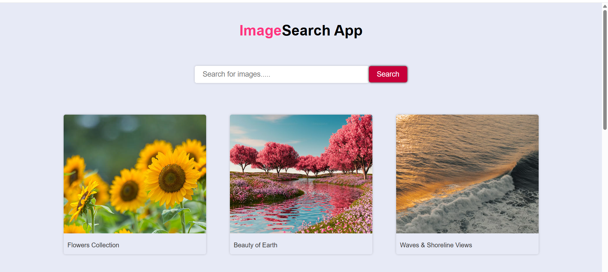

# 🔍 Image Search App

An **Image Search Web Application** built using **HTML, CSS, and JavaScript** that allows users to search and view high-quality images using the **Unsplash API**.

---

## 🚀 Features

- 🔎 Search images by keywords
- 🖼️ Displays high-quality images from Unsplash
- 📱 Responsive design
- ⚡ Fast and user-friendly UI
- 🌐 API-based real-time results

---

## 🛠️ Technologies Used

- **HTML5** – Structure of the application  
- **CSS3** – Styling and layout  
- **JavaScript** – Fetch API & DOM manipulation  
- **Unsplash API** – Image data source  

---

## 📸 Project Preview

